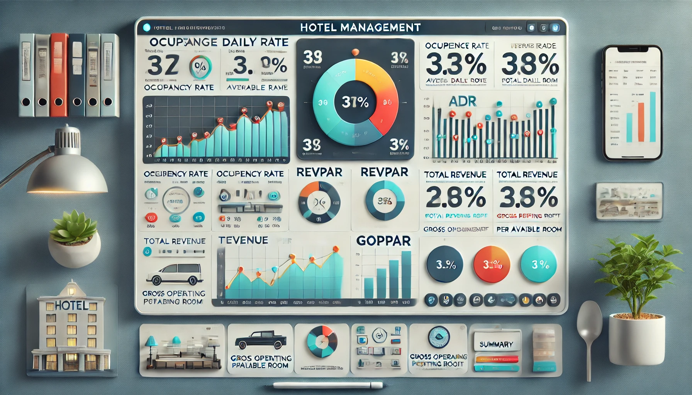
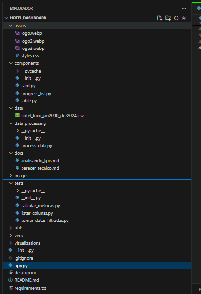
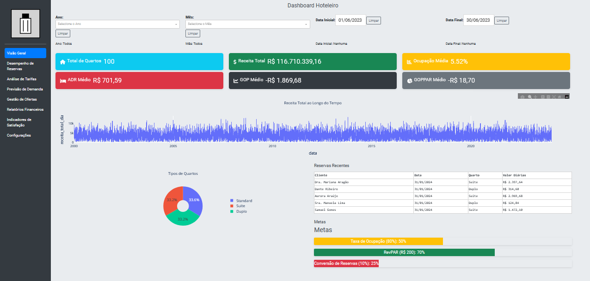
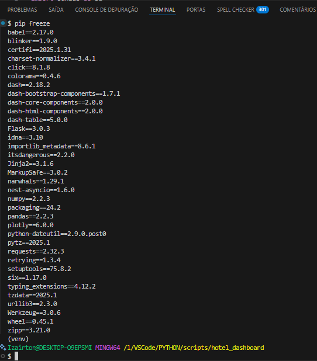
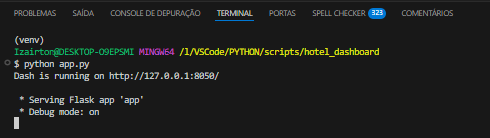
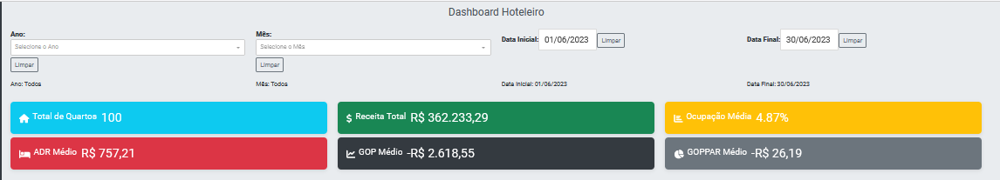
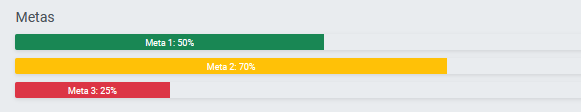

# 📊 Dashboard Hoteleiro para Revenue Management 🏨

## 🎯 Objetivo

Este projeto foi desenvolvido para criar um **Dashboard Hoteleiro** em Python, focado em **Revenue Management**, utilizando dados sintéticos (fictícios, porém realistas) gerados a partir de um arquivo CSV. O dashboard permite a visualização e análise de métricas essenciais para a gestão hoteleira, como **Taxa de Ocupação**, **ADR (Average Daily Rate)**, **RevPAR (Revenue per Available Room)**, **TRevPAR (Total Revenue per Available Room)** e **GOPPAR (Gross Operating Profit per Available Room)**.

O projeto foi construído com base em um arquivo CSV gerado pelo projeto "projeto_kpis_super", que simula dados de um hotel fictício chamado Hotel Luxo. O repositório do projeto pode ser encontrado no GitHub: projeto_csv_super - <https://github.com/IOVASCON/projeto_csv_super.git> O dashboard permite:

- **Visualização de Métricas:** Exibe métricas de Revenue Management em tempo real.
- **Filtros Dinâmicos:** Permite filtrar dados por ano, mês e intervalo de datas.
- **Gráficos Interativos:** Inclui gráficos de linhas, rosca e barras de progresso para análise visual.
- **Tomada de Decisão:** Facilita a análise de desempenho e a identificação de oportunidades de melhoria.

---

## 🏗️ Estrutura do Projeto

O projeto é modular e contém os seguintes arquivos principais:

- **app.py:**  
  Script principal que define a estrutura do dashboard, utilizando **Dash** e **Dash Bootstrap Components (DBC)**. Contém a lógica de filtragem de dados, criação de gráficos e atualização dinâmica do layout.

- **components/:**  
  Pasta com módulos reutilizáveis para criação de componentes do dashboard, como:
  - **card.py:** Cria cards de métricas (ex.: Receita Total, Ocupação Média).
  - **progress_list.py:** Cria barras de progresso para metas (ex.: Taxa de Ocupação, RevPAR).
  - **table.py:** Cria tabelas interativas (ex.: Reservas Recentes).

- **data_processing/process_data.py:**  
  Módulo responsável por carregar e processar o arquivo CSV, calculando métricas de Revenue Management.

- **visualizations/charts.py:**  
  Módulo com funções para criação de gráficos (ex.: gráfico de linhas, gráfico de rosca).

- **data/hotel_luxo_jan2000_dez2024.csv:**  
  Arquivo CSV com dados sintéticos do Hotel Luxo, contendo informações diárias sobre ocupação, receita, custos e lucros.

- **assets/:**  
  Pasta com recursos visuais, como logos e arquivos CSS.

---

## 🗂️ Fluxo de Dados e Funcionalidades

### 1. Carregamento e Processamento de Dados

- O arquivo CSV é carregado e processado para calcular métricas como **Ocupação**, **ADR**, **RevPAR**, **TRevPAR** e **GOPPAR**.
- Os dados são filtrados dinamicamente com base nos filtros selecionados pelo usuário (ano, mês, intervalo de datas).

### 2. Visualização no Dashboard

- **Cards de Métricas:** Exibe métricas agregadas, como Receita Total, Ocupação Média e ADR Médio.
- **Gráfico de Linhas:** Mostra a evolução da Receita Total ao longo do tempo.
- **Gráfico de Rosca:** Exibe a distribuição dos tipos de quartos ocupados.
- **Tabela de Reservas Recentes:** Lista as últimas reservas, com detalhes como nome do cliente, data e valor das diárias.
- **Barras de Progresso:** Indica o progresso em relação a metas pré-definidas (ex.: Taxa de Ocupação de 80%).

### 3. Interatividade

- O dashboard é atualizado dinamicamente conforme o usuário interage com os filtros.
- Botões de "Limpar" permitem resetar os filtros e visualizar todos os dados.

---

## 💻 Tecnologias e Bibliotecas Utilizadas

- **Python 3:** Linguagem de programação principal.
- **Dash:** Framework para criação de dashboards interativos.
- **Dash Bootstrap Components (DBC):** Componentes estilizados para Dash.
- **Pandas:** Manipulação e processamento de dados.
- **Plotly:** Criação de gráficos interativos.
- **Babel:** Formatação de valores monetários.
- **Faker:** Geração de dados fictícios (nomes de clientes, tipos de quartos, etc.).

---

## 🚀 Modo de Uso

### 1. Pré-requisitos

- Python 3.7 ou superior.
- Ambiente virtual recomendado.

python -m venv venv

#### Ativar

#### Windows

.\venv\Scripts\activate

#### Linux/macOS

source venv/bin/activate

#### Instalar dependências

pip install dash dash-bootstrap-components pandas plotly babel faker

### 2. Executar o Dashboard

python app.py

- O dashboard estará disponível em `http://127.0.0.1:8050/`.

### 3. Navegação no Dashboard

- **Filtros:** Utilize os filtros no topo da página para selecionar ano, mês e intervalo de datas.
- **Cards:** Visualize as métricas principais na seção de cards.
- **Gráficos:** Explore os gráficos de linhas e rosca para análises detalhadas.
- **Tabela:** Consulte as reservas recentes na tabela interativa.
- **Metas:** Acompanhe o progresso em relação às metas nas barras de progresso.

---

## 🗂️ Estrutura de Pastas

## 🚀 Clonando o Repositório

git clone <https://github.com/IOVASCON/hotel_dashboard.git>

## 🖼️ Imagens do Desenvolvimento

1. Dashboard:

    

2. Dependências do Projeto:

    

3. Rodando a Aplicação:

    

4. Métricas por Período:

    

5. Metas Base Métricas:

    

---

## 🤝 Contribuições

Contribuições são muito bem-vindas! Se você encontrar problemas ou tiver sugestões:

- Abra uma **issue** para relatar ou sugerir novas funcionalidades.
- Envie um **pull request** com suas melhorias.

---

## 👤 Autor

[Izairton] - [IOVASCON](https://github.com/IOVASCON)

---

## ✨ Melhorias Futuras

- Adicionar mais métricas de Revenue Management.
- Implementar gráficos adicionais (ex.: heatmaps, gráficos de barras).
- Desenvolver uma versão mobile do dashboard.
- Integrar com APIs de sistemas hoteleiros para dados em tempo real.
- Adicionar suporte para múltiplos hotéis.
